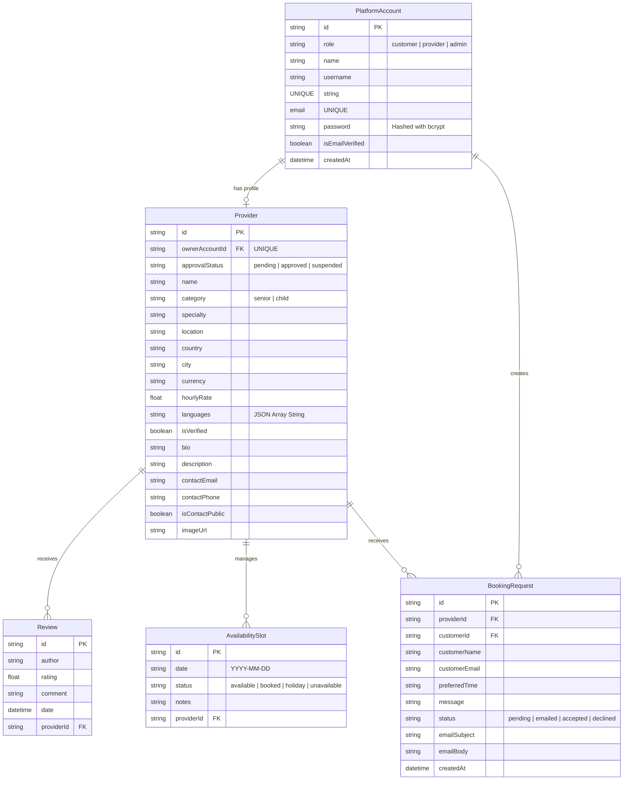

# 🏥 Senior Care & Child Care Platform

A secure, high-performance Next.js application designed to connect customers with verified senior and child care providers. 

---

## 🏗️ Architecture & Tech Stack

- **Frontend & Backend:** [Next.js 16.1.5](https://nextjs.org/) (App Router & Server Actions)
- **Database ORM:** [Prisma 5.22.0](https://www.prisma.io/)
- **Database Engine:** SQLite (Local development) / PostgreSQL (Ready for live production)
- **Security & Cryptography:** `bcryptjs` for secure password hashing and verification

---

## 📊 Database Schema

Below is the database architecture defined in `prisma/schema.prisma`:



---

## 🛡️ Cybersecurity Measures Implemented

1. **Password Cryptography:** Passwords are hashed with **bcrypt** (12 salt rounds). Registration enforces min length + letter/number policy.
2. **HttpOnly Sessions:** Login issues a signed JWT (`AUTH_SECRET`) in an **HttpOnly** cookie (`scp_session`). No session user-id in `localStorage`.
3. **Server-Side Authorization:** Registration, reviews, availability, approvals, admin create, and booking requests go through authenticated API routes with role checks.
4. **Rate Limiting:** Login and registration are rate-limited per IP (and login per identifier).
5. **No Client Secret Leakage:** Seed accounts / password hashes live only in `prisma/seed-data.ts` (not shipped to the browser).
6. **SQL Injection Protection:** Prisma parameterized queries.
7. **Security Headers:** Clickjacking, MIME sniffing, HSTS, Permissions-Policy, and **Content-Security-Policy** in `next.config.ts`.
8. **Git Protection:** `.env*`, `*.db` ignored. See `.env.example` for required vars (`DATABASE_URL`, `AUTH_SECRET`).

---

## 💻 Local Setup & Development

### 1. Installation
Install dependencies:
```bash
npm install
```

### 2. Database Sync
Create the local SQLite database and push the schema tables:
```bash
npx prisma db push
```

### 3. Seed Database
Seed the database with default admin, customer, provider accounts, and provider profiles:
```bash
npx tsx prisma/seed.ts
```

### 4. Run Locally
Start the local development server:
```bash
npm run dev -- -p 3001
```
Open **[http://localhost:3001](http://localhost:3001)** in your browser.

---

## 📈 Version Control System Setup (Git)

Since Git is not currently installed or in your command line path, follow these steps to set up version control:

### 1. Download & Install Git
1. Download Git for Windows: **[https://git-scm.com/download/win](https://git-scm.com/download/win)**
2. Install with default settings.
3. Restart your terminal or VS Code to apply path changes.

### 2. Initialize Git Repository
Once Git is installed, run the following commands in the project folder:
```bash
# Initialize local repository
git init

# Add all project files (will automatically respect .gitignore)
git add .

# Create the initial version commit
git commit -m "Initial commit: Secure Next.js platform with SQLite database"
```

### 3. Connect to GitHub
1. Go to **[GitHub](https://github.com/)** and create a new repository (name it `senior-care-platform`). Keep it **Private** for security.
2. Run these commands in your project folder to link and push your code:
```bash
git remote add origin https://github.com/YOUR_USERNAME/senior-care-platform.git
git branch -M main
git push -u origin main
```

---

## 🚀 Live Deployment Guide

To go live, we will host the Next.js app on **Vercel** and connect it to a free hosted PostgreSQL database on **Neon.tech** or **Supabase**.

### Step 1: Create a Production Database
1. Create a free account at **[Neon.tech](https://neon.tech/)**.
2. Create a new project and select **PostgreSQL**.
3. Copy the **Connection String** (starts with `postgresql://...`).

### Step 2: Configure your Code for PostgreSQL
1. Open [`prisma/schema.prisma`](file:///c:/chat%20gpt/senior-care-platform/prisma/schema.prisma) and change the provider to `postgresql`:
   ```prisma
   datasource db {
     provider = "postgresql"
     url      = env("DATABASE_URL")
   }
   ```
2. Remove any local SQLite adapter configurations from [`lib/db.ts`](file:///c:/chat%20gpt/senior-care-platform/lib/db.ts) and [`prisma/seed.ts`](file:///c:/chat%20gpt/senior-care-platform/prisma/seed.ts) (use standard `new PrismaClient()` in production).
3. Push your updated code to your GitHub repository.

### Step 3: Deploy on Vercel
1. Log in to **[Vercel](https://vercel.com/)** using your GitHub account.
2. Click **Add New** → **Project** and import your `senior-care-platform` repository.
3. Under **Environment Variables**, add:
   - `DATABASE_URL` = (Paste your Neon.tech connection string)
4. Click **Deploy**. Vercel will build, optimize, and launch your website live with a secure SSL certificate.
